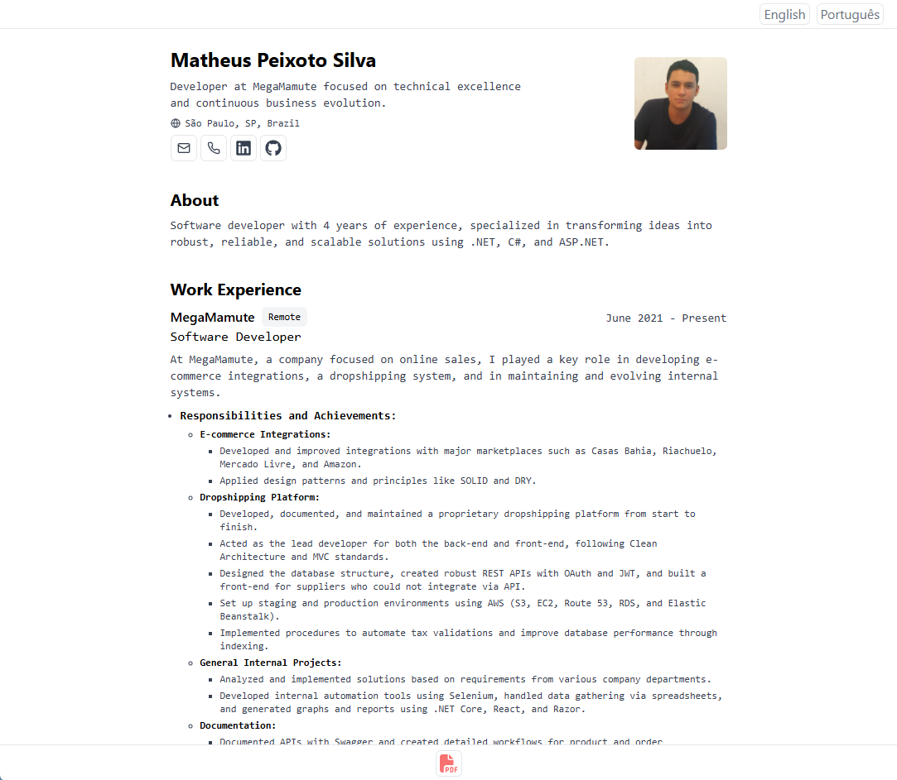

# Resume

This project aims to create a resume optimized for ATS (Applicant Tracking Systems) and TAs (Talent Acquisition Systems). The main idea is to present the content in a clean, simple, and direct way, prioritizing readability and automated analysis. The structure follows a single-column format with clear sections for keywords, technical skills, and other relevant information, all presented in a concise and minimalist way.

## Features

- **ATS and TA focused:**  
  The content, structure, and markup are designed to improve readability by automated recruitment systems. This includes the strategic use of keywords, well-defined sections, and clear formatting that help ATS (Applicant Tracking Systems) and talent acquisition teams identify relevant experience.

- **Single-column layout:**  
  The linear presentation of information, without visual distractions or multiple columns, helps ATS tools process the document without losing context. It also improves human readability and navigation.

- **Bullet points for key information:**  
  The use of bullet lists to highlight responsibilities, achievements, and key skills is highly recommended for ATS/TA. These systems often search for specific terms and highlighted points in bullet format, which increases analysis accuracy and makes the content easier to scan for human recruiters.

- **Minimalism:**  
  By reducing unnecessary visual elements, the document becomes easier for automated tools to parse. A clean and consistent design ensures that the focus remains on the content, helping ATS/TA extract information more efficiently.

- **Responsive design:**  
  Dynamic adjustment to different screen sizes ensures the CV can be viewed clearly on any device without compromising the ATS/TA-optimized structure.

- **Styles optimized for web and PDF:**  
  Tailwind print classes for each media type (browser and PDF) ensure that the printed version maintains readability, proper formatting, and the visual hierarchy designed for ATS/TA, just like the online version. This results in a resume that both machines and human recruiters can easily analyze.

## How to run the project

This project is based on standard web technologies. You can serve the files locally using any static server, or install the dependencies and run a development environment if a build system or bundler is configured.

### Using PNPM

1. **Install PNPM or another package manager of your choice (the instructions below use pnpm as an example):**  
   If you do not have PNPM installed, see the [official documentation](https://pnpm.io/installation).

2. **Install the dependencies:**  
   ```bash
   pnpm install

3. **Start the development server:**
   ```bash
   pnpm start

Then open http://localhost:3000 in your browser.

## How to create your own resume from this project

  1. **Edit the resume data**  
  The main files are located in the `src/data` directory. Modify the `Resume*.ts` files to update sections, text, keywords, and technical skills according to your professional profile.

  2. **Add new languages**  
  - Create a new `Resume*.ts` file for the desired language.

  - Add this file to the re-export in the `src/data/index.ts` file.

  - Create a route for the language following the existing pattern:

    - Follow the pattern inside `src/data` and create the resume content for the new language, German for example, inheriting from the Resume interface (e.g. `src/data/ResumeDE.ts`).

    - Add a folder named with the language abbreviation (e.g. `de` for German generating `src/app/de`). 
    
    - Inside this new folder create a `page.tsx` following the existing pattern generating `src/app/de/page.tsx`.

    - In the `resumesMap` object include the same name as the new folder as the key (e.g. `"de"`).

    Example:
    ```ts
    import { Resume } from "@/types/resume";
    import { RESUMEEN } from './ResumeEN';
    import { RESUMEPTBR } from './ResumePTBR';
    import { RESUMEDE } from './ResumeDE';

    const resumesMap: Record<string, Resume> = {
      "en": RESUMEEN,
      "pt-br": RESUMEPTBR,
      "de": RESUMEDE
    };

    export default resumesMap;
    ```

  3. **Adjust the formatting for PDF:**  
  When printing the resume from the browser (Ctrl+P or Cmd+P) or clicking the footer button, adjust margins, orientation, and other page details to achieve a final result optimized for your PDF resume. Experiment with different configurations until you reach the desired formatting.

## Credits and Inspiration

This project was created from scratch with a focus on ATS/TA optimization and a minimalist visual style. The visual inspiration came from the beautiful project by [Bartosz Jarocki](https://github.com/BartoszJarocki/cv/). All the code is original and only the visual concept was used as a reference to maintain a simplified aesthetic standard.