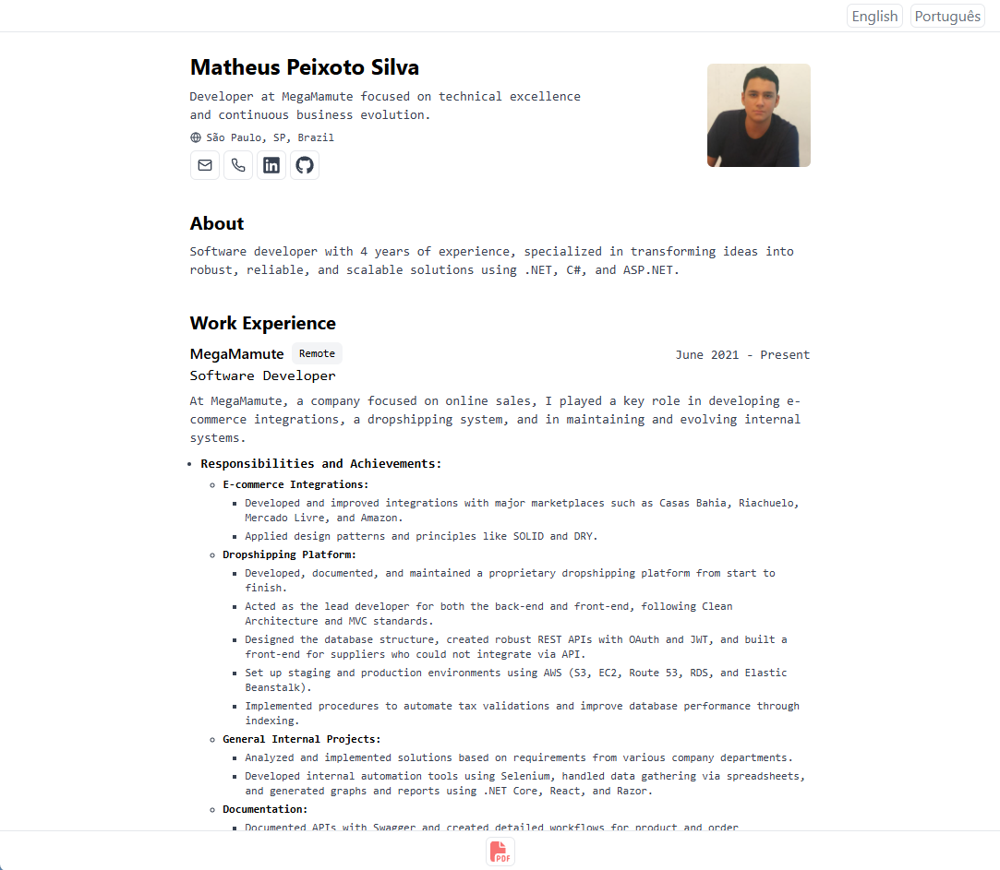

# Resume

Este projeto visa criar um currículo otimizado para ATS (Applicant Tracking Systems) e TAs (Talent Acquisition Systems). A ideia principal é apresentar o conteúdo de forma limpa, simples e direta, priorizando a legibilidade e a análise automatizada. A estrutura segue um formato de coluna única, com seções claras para palavras-chave, habilidades técnicas e demais informações relevantes, tudo de maneira concisa e minimalista.

## Características

- **Foco em ATS e TAs:**  
  O conteúdo, a estruturação e a marcação são pensados para melhorar a leitura por sistemas de recrutamento automatizados. Isso inclui o uso estratégico de palavras-chave, seções bem definidas e formatação clara que facilitam a identificação de experiências relevantes pelos ATS (Applicant Tracking Systems) e TAs (Talent Acquisition).

- **Layout em coluna única:**  
  A apresentação linear da informação, sem distrações visuais ou colunas múltiplas, auxilia ATS/TA a analisarem o documento sem perda de contexto. Isso também facilita a navegação e a leitura humana.

- **Bullet points descrevendo pontos importantes:**  
  A utilização de listas pontuais para destacar responsabilidades, conquistas e habilidades-chave é altamente recomendada para ATS/TA. Esses sistemas costumam buscar termos específicos e pontos de destaque em formato de bullet points, o que aumenta a precisão na análise e torna o conteúdo mais escaneável para recrutadores humanos.

- **Minimalismo:**  
  Ao reduzir elementos visuais supérfluos, o documento se torna mais fácil de ser “lido” por ferramentas automatizadas. Um design limpo e consistente garante que o foco permaneça no conteúdo, ajudando ATS/TA a extrair informações de forma mais eficiente.

- **Design responsivo:**  
  Ajuste dinâmico a diferentes tamanhos de tela garante que o CV possa ser visualizado de forma legível em qualquer dispositivo, sem comprometer a estrutura otimizada para ATS/TA.

- **Estilos otimizados para web e PDF:**  
  O uso da classes para print do Tailwind para cada tipo de mídia (browser e PDF) assegura que a versão impressa mantenha a legibilidade, formatação adequada e hierarquia visual pensada para ATS/TA, assim como a versão online. Isso resulta em um currículo que tanto a máquina quanto o recrutador humano conseguem analisar com facilidade.

## Como executar o projeto

Este projeto é baseado em tecnologias web padrão. Você pode servir os arquivos localmente usando qualquer servidor estático ou instalar as dependências e rodar um ambiente de desenvolvimento caso um build system ou bundler estejam configurados.

### Usando PNPM

1. **Instale o PNPM (se necessário):**  
   Caso não tenha o PNPM instalado, consulte a [documentação oficial](https://pnpm.io/installation).

2. **Instale as dependências:**  
   ```bash
   pnpm install

3. **Inicie o servidor de desenvolvimento:**
   ```bash
   pnpm start

Em seguida, acesse http://localhost:3000 no seu navegador.

## Como criar seu próprio currículo a partir deste projeto

  1. **Edite às informações do currículo**  
  Os arquivos principais estão localizados no diretório `src/data`. Altere os arquivos `Resume*.ts` para atualizar seções, textos, palavras-chave e habilidades técnicas de acordo com o seu perfil profissional.

  2. **Adicione novos idiomas**  
  - Crie um novo arquivo `Resume*.ts` para o idioma desejado.

  - Adicione este arquivo à re-exportação no arquivo `src/data/index.ts`.

  - Crie uma rota para o idioma seguindo o padrão existente:

    - Adicione um arquivo com a abreviação do idioma (ex.: `pt-br`) contendo um `page.tsx` no diretório correspondente.

    - No objeto `resumesMap`, inclua o mesmo nome da nova pasta como chave (ex.: `"pt-br"`).

    Exemplo:
    ```bash
    import { Resume } from "@/types/resume";
    import { RESUMEEN } from './ResumeEN';
    import { RESUMEPTBR } from './ResumePTBR';

    const resumesMap: Record<string, Resume> = {
      "en": RESUMEEN,
      "pt-br": RESUMEPTBR,
    };

    export default resumesMap;

  3. **Ajuste a formatação para PDF:**  
  Ao imprimir o currículo pelo navegador (Ctrl+P ou Cmd+P), você pode ajustar margens, orientações e outros detalhes da página para obter um resultado final otimizado em PDF. Experimente diferentes configurações até alcançar a formatação desejada.

## Créditos e Inspiração

Este projeto foi criado do zero com foco em otimização para ATS/TA e visual minimalista. A inspiração visual foi tirado do belíssimo projeto de [Bartosz Jarocki](https://github.com/BartoszJarocki/cv/). Todo o código é próprio e apenas o conceito visual foi referência para manter um padrão estético simplificado.